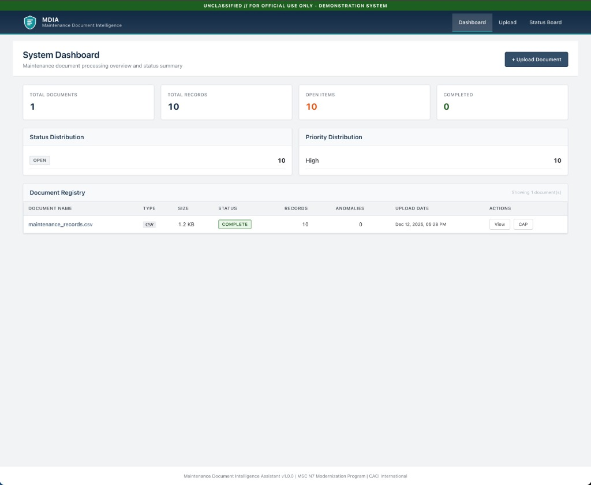
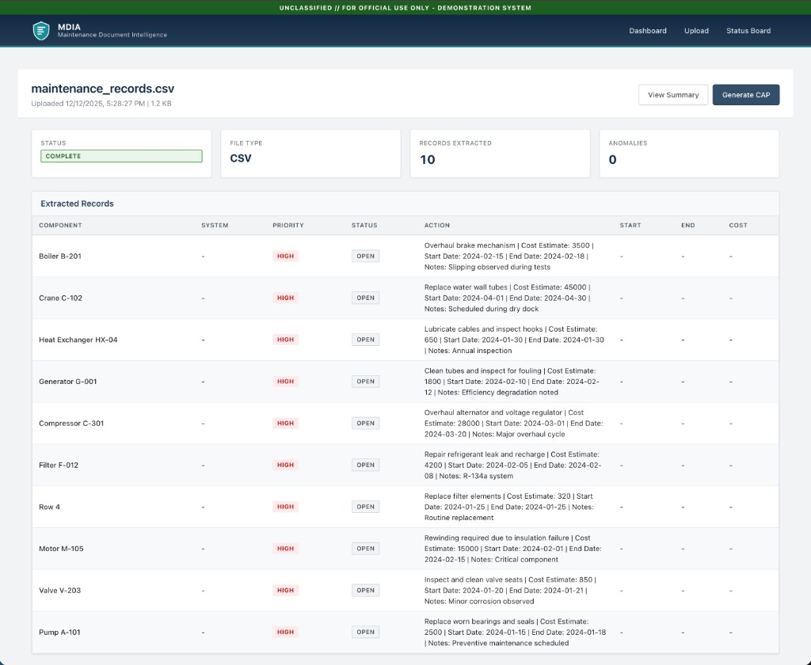
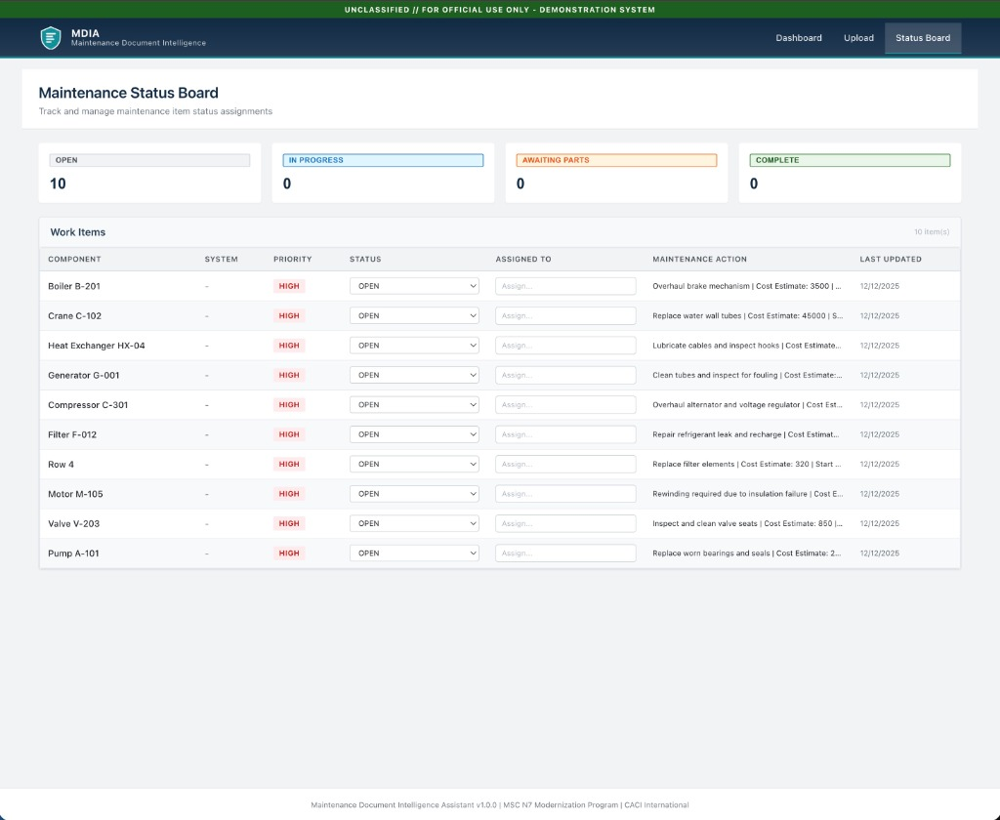
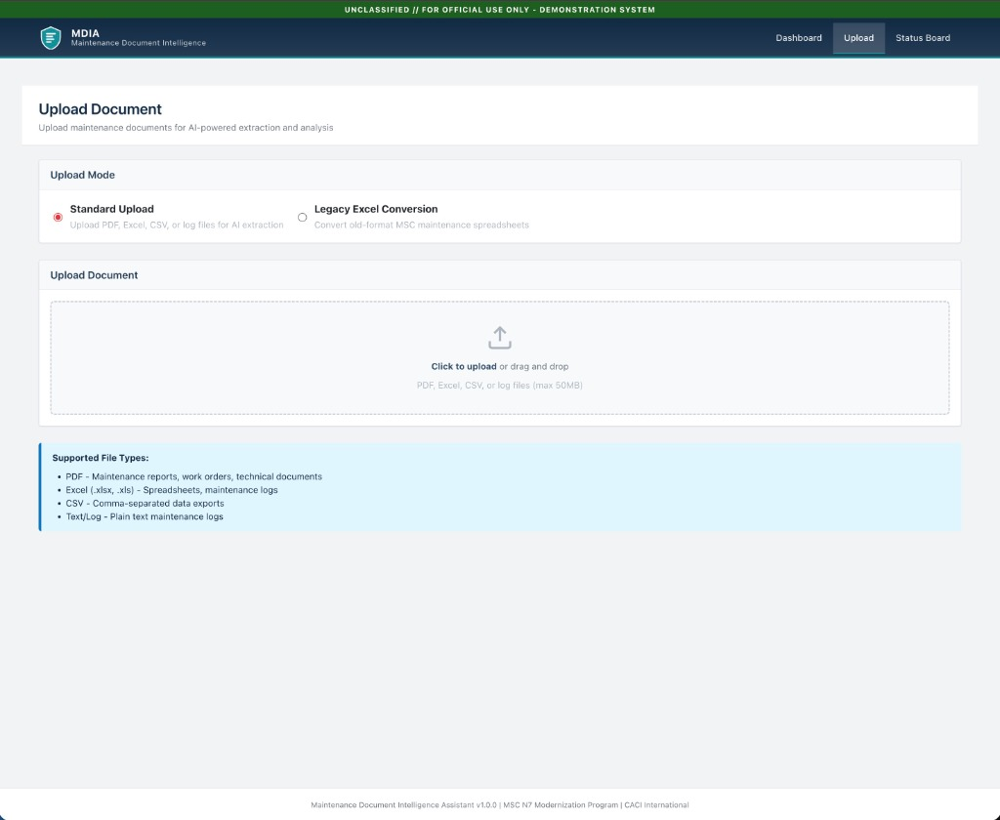

# MDIA - Maintenance Document Intelligence Assistant

<p align="center">
  
</p>

## Overview

**MDIA** is a full-stack AI-powered application designed to modernize MSC-style engineering and maintenance workflows. Built for the CACI MSC N7 Modernization Program, MDIA transforms how maintenance teams process, track, and manage engineering documents.

### The Problem

Military Sealift Command (MSC) engineering teams manage thousands of maintenance documents across legacy formats—PDFs, old Excel spreadsheets, handwritten logs, and inconsistent data structures. Manual data entry is time-consuming, error-prone, and creates bottlenecks in maintenance workflows.

### The Solution

MDIA leverages AI-powered document processing to:
- **Automatically extract** structured data from unstructured maintenance documents
- **Normalize** legacy formats into a consistent, queryable schema
- **Detect anomalies** in data quality (missing fields, date inconsistencies, extreme values)
- **Track status** of maintenance items through their lifecycle
- **Generate reports** including Corrective Action Plans (CAPs)

---

## Screenshots

### System Dashboard
<p align="center">
  
</p>

The dashboard provides a real-time overview of document processing status, including:
- Key metrics (total documents, records, open items, completed)
- Status and priority distribution breakdowns
- Document registry with quick actions

---

### Document Detail View
<p align="center">
  
</p>

After AI-powered extraction, view all structured records pulled from the source document:
- Component identification and system classification
- Priority levels and maintenance actions
- Cost estimates, dates, and technician notes
- One-click CAP generation

---

### Maintenance Status Board
<p align="center">
  
</p>

Interactive Kanban-style status tracking:
- Filter by status (Open, In Progress, Awaiting Parts, Complete)
- Inline status updates and assignee management
- Real-time counts per status category
- Data-dense table view for efficiency

---

### Document Upload
<p align="center">
  
</p>

Flexible document ingestion:
- Drag-and-drop file upload
- Support for PDF, Excel, CSV, and log files
- Legacy Excel conversion mode for old-format MSC spreadsheets
- Automatic AI extraction on upload

---

## Tech Stack

### Backend
| Technology | Purpose |
|------------|---------|
| **Python 3.11** | Core language |
| **FastAPI** | High-performance async API framework |
| **SQLAlchemy 2.0** | ORM for database operations |
| **PostgreSQL** | Production database (SQLite for local dev) |
| **pdfplumber** | PDF text and table extraction |
| **pandas** | Excel/CSV data processing |
| **Hugging Face** | LLM integration (Mistral-7B) |

### Frontend
| Technology | Purpose |
|------------|---------|
| **React 18** | UI framework |
| **TypeScript** | Type-safe JavaScript |
| **Vite** | Fast build tooling |
| **Vanilla CSS** | Custom design system (no dependencies) |

### Infrastructure
| Technology | Purpose |
|------------|---------|
| **Docker** | Containerization |
| **Docker Compose** | Multi-container orchestration |
| **PostgreSQL 15** | Data persistence |

---

## Quick Start

### Prerequisites
- Docker and Docker Compose
- (Optional) Hugging Face API token for LLM features

### 1. Clone the Repository
```bash
git clone https://github.com/michaelromero212/CACI-Maintenance-Document-Intelligence-Assistant.git
cd CACI-Maintenance-Document-Intelligence-Assistant
```

### 2. Configure Environment
```bash
cp .env.example .env
# Optional: Add your Hugging Face token to .env
```

### 3. Start Services
```bash
docker-compose up --build
```

### 4. Access the Application
- **Frontend:** http://localhost:3000
- **Backend API:** http://localhost:8000
- **API Docs:** http://localhost:8000/docs

---

## API Endpoints

| Method | Endpoint | Description |
|--------|----------|-------------|
| `GET` | `/health` | Health check |
| `POST` | `/upload` | Upload a document |
| `GET` | `/documents` | List all documents |
| `GET` | `/documents/{id}` | Get document details |
| `POST` | `/ingest/{id}` | Process a document |
| `POST` | `/legacy/convert` | Convert legacy Excel |
| `GET` | `/records` | List extracted records |
| `PATCH` | `/record/{id}/status` | Update record status |
| `GET` | `/status/overview` | Get status statistics |
| `GET` | `/report/summary` | Generate summary report |
| `GET` | `/report/cap` | Generate Corrective Action Plan |

---

## Security Considerations for Production Deployment

This demo runs in a local development environment. For deployment in a **secure government or enterprise environment** (e.g., MSC/Navy networks, FedRAMP, IL4/IL5), the following security controls would be implemented:

### Network Security
| Control | Implementation |
|---------|----------------|
| Network Isolation | Deploy in private VPC/VLAN with no direct internet access |
| TLS Encryption | Enforce TLS 1.3 for all traffic with DoD-approved certificates |
| Reverse Proxy | nginx/HAProxy with TLS termination and rate limiting |
| Web Application Firewall | ModSecurity or similar for OWASP Top 10 protection |
| Egress Filtering | Whitelist-only outbound connections |

### Authentication & Authorization
| Control | Implementation |
|---------|----------------|
| CAC/PIV Integration | Smart card authentication via DoD PKI |
| SSO/SAML | Enterprise IdP integration (ADFS, Keycloak) |
| Role-Based Access | Admin, Engineer, Viewer permission levels |
| Session Management | Short-lived JWTs, secure cookies, auto-timeout |
| Audit Logging | All authentication events logged to SIEM |

### Data Protection
| Control | Implementation |
|---------|----------------|
| Encryption at Rest | PostgreSQL TDE or encrypted storage volumes |
| Encryption in Transit | TLS for all service-to-service communication |
| Data Classification | CUI/FOUO tagging per document |
| Backup Encryption | AES-256 with separate key management |
| Data Retention | Automated policies per NARA guidelines |

### LLM/AI Security for Air-Gapped Networks
| Option | Description |
|--------|-------------|
| Local Model Deployment | Run Mistral-7B on local GPU using vLLM or TGI |
| FedRAMP Cloud AI | Azure Government or AWS GovCloud AI services |
| Model Validation | Review model outputs before production use |
| Data Isolation | No document data sent to external APIs |

### Container Security
| Control | Implementation |
|---------|----------------|
| Base Images | Iron Bank / DoD-hardened containers |
| Image Scanning | Trivy/Clair scanning before deployment |
| Runtime Security | Read-only root filesystem, non-root execution |
| Secrets Management | HashiCorp Vault or K8s encrypted secrets |

### Compliance Frameworks
| Framework | Key Requirements |
|-----------|------------------|
| **NIST 800-53** | Access control, audit, system integrity |
| **FedRAMP** | Moderate/High baseline for cloud |
| **STIG** | OS, database, and container hardening |
| **RMF** | Complete ATO package (SSP, SAR, POA&M) |

---

## Project Structure

```
├── backend/
│   ├── api/routes/          # FastAPI route handlers
│   ├── db/                   # Database configuration
│   ├── ingestion/            # PDF, Excel, CSV extractors
│   ├── llm/                  # LLM client and prompts
│   ├── models/               # SQLAlchemy models
│   ├── reports/              # CAP generation
│   ├── services/             # Business logic
│   └── tests/                # Pytest tests
├── frontend/
│   ├── src/
│   │   ├── api/              # API client
│   │   ├── components/       # React components
│   │   └── pages/            # Page views
├── db/
│   └── schema.sql            # PostgreSQL schema
├── docs/
│   └── images/               # Screenshots
├── samples/                  # Test data
├── docker-compose.yml
└── README.md
```

---

## Accessibility

The UI is designed to meet **WCAG AA** standards:
- High contrast color ratios (minimum 4.5:1)
- Semantic HTML structure
- Full keyboard navigation
- Visible focus indicators
- Screen reader compatible
- Print-optimized styles

---

## License

Demo project for CACI MSC N7 Modernization Program

---

<p align="center">
  <strong>MDIA v1.0.0</strong> | Built with FastAPI + React + PostgreSQL
</p>
